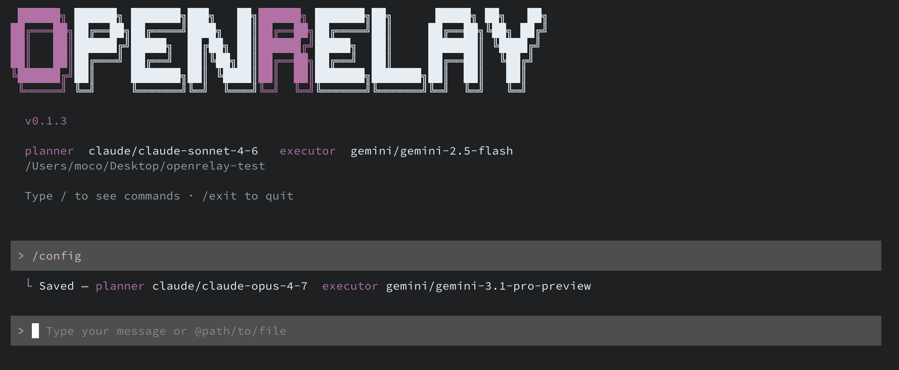

# OpenRelay

> Multi-agent orchestration CLI — run a **planner** and an **executor** as a crew, directly from your terminal.

[](https://www.npmjs.com/package/@velantex/openrelay)
[](LICENSE)
[](https://bun.sh)

<!-- Replace with a real screenshot or GIF of the TUI dashboard -->



---

## What it does

OpenRelay wires two AI agents together:

- **Planner** — breaks your task into steps, detects deviations, and controls the budget.
- **Executor** — runs each step inside your project directory using your preferred CLI agent.

You define the crew once in a `crew.md` file. OpenRelay handles the orchestration loop, checkpoints, token budgets, and a live terminal dashboard — you just give it a task.

---

## Requirements

- [Bun](https://bun.sh) `>= 1.3.13`
- At least one supported CLI agent installed and authenticated:
  - [`claude`](https://docs.anthropic.com/en/docs/claude-code) — Claude Code
  - [`gemini`](https://github.com/google-gemini/gemini-cli) — Gemini CLI
  - [`codex`](https://github.com/openai/codex) — OpenAI Codex CLI
  - [`opencode`](https://opencode.ai) — OpenCode

---

## Install

```bash
npm install -g @velantex/openrelay
```

---

## Quick start

```bash
# 1. Go to any project directory
cd my-project

# 2. Launch OpenRelay
openrelay

# 3. Initialize a crew.md
/init

# 4. Configure your agents (interactive wizard)
/config

# 5. Run a task
/run add input validation to the login form in @login_file.ts
```

---

## crew.md reference

OpenRelay reads `crew.md` from the current directory. Format: TOML.

```toml
[session]
max_retries        = 2    # retries per failed task
summary_interval   = 10   # messages between context summaries
checkpoint_timeout = 300  # seconds before a checkpoint auto-approves

[[agents]]
id           = "orchestrator"
role         = "planner"
cli          = "claude"
model        = "claude-opus-4-7"
token_budget = 50000
checkpoints  = ["plan_ready", "deviation_found"]

[[agents]]
id           = "executor"
role         = "coder"
cli          = "gemini"
model        = "gemini-2.5-pro"
token_budget = 200000
working_dir  = "."
checkpoints  = []
```

### Supported CLI agents and models

| `cli`      | Planner models                                                          | Executor models                                                                          |
| ---------- | ----------------------------------------------------------------------- | ---------------------------------------------------------------------------------------- |
| `claude`   | `claude-opus-4-7`, `claude-sonnet-4-6`                                  | `claude-sonnet-4-6`, `claude-haiku-4-5-20251001`                                         |
| `gemini`   | `gemini-3.1-pro-preview`, `gemini-3-flash-preview`, `gemini-2.5-pro`, `gemini-2.5-flash` | `gemini-3.1-pro-preview`, `gemini-3-flash-preview`, `gemini-3.1-flash-lite-preview`, `gemini-2.5-pro`, `gemini-2.5-flash`, `gemini-2.5-flash-lite` |
| `codex`    | `gpt-5.5`, `gpt-5.4`, `gpt-5.2`                                         | `gpt-5.5`, `gpt-5.4-mini`, `gpt-5.3-codex`, `gpt-5.4`                                   |
| `opencode` | `claude-opus-4-7`, `claude-sonnet-4-6`                                  | `claude-sonnet-4-6`, `claude-haiku-4-5-20251001`                                         |

You can also use API mode (no CLI required) by setting `mode = "api"` and providing a `provider` and key via environment variable.

### Checkpoints

Checkpoints pause execution and ask for your approval before continuing. Available events:

| Event             | When it fires                                     |
| ----------------- | ------------------------------------------------- |
| `plan_ready`      | After the planner generates the initial task list |
| `deviation_found` | When the executor's output diverges from the plan |
| `task_done`       | After each individual task completes              |
| `budget_warning`  | When a token budget reaches 80%                   |

---

## Commands

All commands are available in the interactive REPL (`openrelay`) and as CLI flags.

| Command       | Description                                          |
| ------------- | ---------------------------------------------------- |
| `/init`       | Create a `crew.md` skeleton in the current directory |
| `/config`     | Open the interactive agent configuration wizard      |
| `/run <task>` | Run a task with the configured crew                  |
| `/status`     | Show the latest session status                       |
| `/history`    | Show past sessions                                   |
| `/setup`      | Install recommended MCP servers and skills           |
| `/help`       | List all commands                                    |
| `/exit`       | Exit OpenRelay                                       |

### Attach files to a task

Prefix any path with `@` to include the file contents as context:

```
/run refactor the auth module @src/auth/handler.ts @docs/auth-spec.md
```

---

## Non-interactive usage

```bash
# Run a task directly (no REPL)
openrelay run "write unit tests for src/utils.ts" --dir ./my-project

# Dry-run: show the crew config without executing
openrelay run "any task" --dry-run

# Show last session status
openrelay status

# Show session history
openrelay history --limit 20
```

---

## Monorepo structure

```
packages/
  core/       @openrelay/core      MessageBus, base types
  config/     @openrelay/config    crew.md loader and validator
  adapters/   @openrelay/adapters  CLI and API agent adapters
  planner/    @openrelay/planner   Orchestration loop, budget, checkpoints
  tui/        @openrelay/tui       Terminal dashboard (Ink/React)
apps/
  cli/        openrelay            Entry point — wires everything together
```

---

## License

MIT © [Velantex](https://github.com/velantex)
